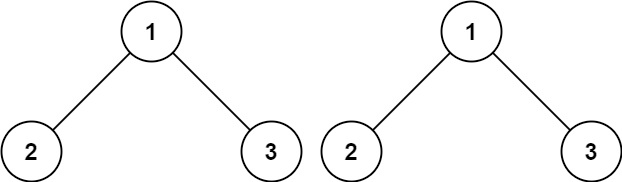
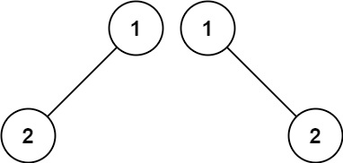
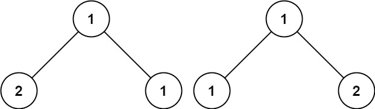

# 100. Same Tree

- Difficulty: Easy
- Tags: Tree, Depth-First Search, Breadth-First Search, Binary Tree

## Problem

Given the roots of two binary trees `p` and `q`, write a function to check if they are the same or not.

Two binary trees are considered the same if they are structurally identical and the nodes have the same value.

## Examples

### Example 1

Input: `p = [1,2,3]`, `q = [1,2,3]`  
Output: `true`

### Example 2

Input: `p = [1,2]`, `q = [1,null,2]`  
Output: `false`

### Example 3

Input: `p = [1,2,1]`, `q = [1,1,2]`  
Output: `false`

## Constraints

- The number of nodes in both trees is in the range `[0, 100]`.
- `-10^4 <= Node.val <= 10^4`

## Approach

This solution uses an iterative breadth-first comparison with two queues:

- Dequeue one node from each tree at the same time.
- If one node is `null` and the other is not, the trees are different.
- If both nodes exist but their values differ, the trees are different.
- Enqueue both left children and both right children, including `null` values, so tree structure is compared as well.

## Complexity

- Time: `O(n)`
- Space: `O(n)`
