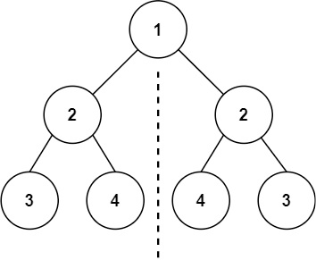
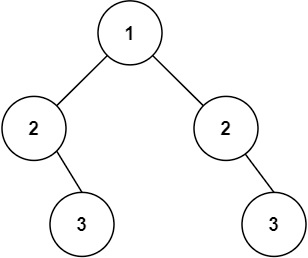

# 101. Symmetric Tree

- Difficulty: Easy
- Tags: Tree, Depth-First Search, Breadth-First Search, Binary Tree

## Problem

Given the root of a binary tree, check whether it is a mirror of itself, which means it is symmetric around its center.

## Examples

### Example 1

Input: `root = [1,2,2,3,4,4,3]`  
Output: `true`

### Example 2

Input: `root = [1,2,2,null,3,null,3]`  
Output: `false`

## Constraints

- The number of nodes in the tree is in the range `[1, 1000]`.
- `-100 <= Node.val <= 100`

## Approaches

### Iterative BFS

This solution uses an iterative breadth-first traversal with a queue:

- Insert the left and right child of the root as a mirrored pair.
- Remove nodes two at a time and compare them.
- If one node is `null` and the other is not, the tree is not symmetric.
- If both nodes exist but their values differ, the tree is not symmetric.
- Add children back to the queue in mirror order: left-left with right-right, and left-right with right-left.

### Recursive Mirror Check

The recursive version compares two nodes at a time:

- If both nodes are `null`, they are symmetric at that position.
- If only one node is `null`, the tree is not symmetric.
- If both nodes exist, their values must match.
- Then compare the outer children and inner children recursively:
  `left.left` with `right.right`, and `left.right` with `right.left`.

## Complexity

- Time: `O(n)`
- Space: `O(n)`
