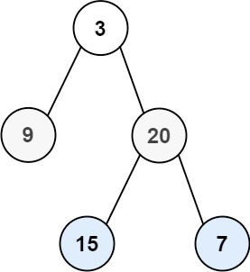

# 103. Binary Tree Zigzag Level Order Traversal

- Difficulty: Medium
- Tags: Tree, Breadth-First Search, Binary Tree

## Problem

Given the root of a binary tree, return the zigzag level order traversal of its nodes' values.

This means:
- the first level is read from left to right,
- the next level is read from right to left,
- and the direction continues to alternate for each level.

## Examples

### Example 1

Input: `root = [3,9,20,null,null,15,7]`  
Output: `[[3],[20,9],[15,7]]`

### Example 2

Input: `root = [1]`  
Output: `[[1]]`

### Example 3

Input: `root = []`  
Output: `[]`

## Constraints

- The number of nodes in the tree is in the range `[0, 2000]`.
- `-100 <= Node.val <= 100`

## Approach

This solution uses breadth-first search with a queue:

- Add the root node to the queue.
- For each level, record the current queue size so only nodes from that level are processed.
- Collect the values in normal left-to-right order while adding child nodes to the queue.
- Reverse the collected list on every other level to create the zigzag pattern.
- Toggle the direction after each level.

## Complexity

- Time: `O(n)`
- Space: `O(n)`
