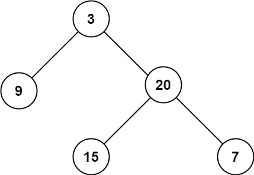

# 104. Maximum Depth of Binary Tree

- Difficulty: Easy
- Tags: Tree, Depth-First Search, Breadth-First Search, Binary Tree

## Problem

Given the root of a binary tree, return its maximum depth.

A binary tree's maximum depth is the number of nodes along the longest path from the root node down to the farthest leaf node.

## Examples

### Example 1

Input: `root = [3,9,20,null,null,15,7]`  
Output: `3`

### Example 2

Input: `root = [1,null,2]`  
Output: `2`

## Constraints

- The number of nodes in the tree is in the range `[0, 10^4]`.
- `-100 <= Node.val <= 100`

## Approaches

### Iterative BFS

This implementation uses a queue that stores each node together with its depth:

- Start with the root at depth `1`.
- Remove one node at a time from the queue.
- Update the maximum depth seen so far.
- Add each child back to the queue with depth `currentDepth + 1`.

### Recursive DFS

The recursive version works by:

- returning `0` for a `null` node,
- recursively computing the depth of the left and right subtrees,
- returning the larger depth plus `1` for the current node.

## Complexity

- Time: `O(n)`
- Space: `O(n)` for BFS in the worst case
- Space: `O(h)` for recursion, where `h` is the tree height
