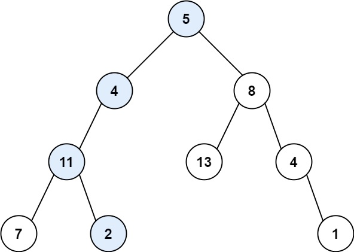
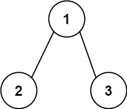

# 112. Path Sum

- Difficulty: Easy
- Tags: Tree, Depth-First Search, Breadth-First Search, Binary Tree

## Problem

Given the root of a binary tree and an integer `targetSum`, return `true` if the tree has a root-to-leaf path such that adding up all the values along the path equals `targetSum`.

A leaf is a node with no children.

## Examples

### Example 1

Input: `root = [5,4,8,11,null,13,4,7,2,null,null,null,1]`, `targetSum = 22`  
Output: `true`  
Explanation: The highlighted root-to-leaf path adds up to `22`.

### Example 2

Input: `root = [1,2,3]`, `targetSum = 5`  
Output: `false`  
Explanation: The available root-to-leaf sums are `3` and `4`, so no path matches `5`.

### Example 3

Input: `root = []`, `targetSum = 0`  
Output: `false`

## Constraints

- The number of nodes in the tree is in the range `[0, 5000]`.
- `-1000 <= Node.val <= 1000`
- `-1000 <= targetSum <= 1000`

## Approaches

### Recursive DFS

This solution reduces the target as it moves down the tree:

- Subtract the current node value from the remaining target.
- If a leaf is reached, check whether the remaining target is `0`.
- Otherwise, continue searching the left or right subtree.

### Iterative BFS

The file also includes a breadth-first version:

- Store each node together with the path sum accumulated to that node.
- When a leaf is reached, compare its path sum with `targetSum`.
- If any leaf matches, return `true`; otherwise return `false`.

## Complexity

- Time: `O(n)`
- Space: `O(n)` in the worst case
