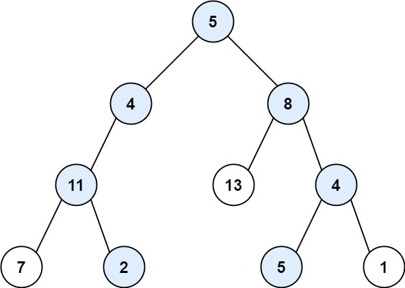

# 113. Path Sum II

- Difficulty: Medium
- Tags: Tree, Depth-First Search, Backtracking, Binary Tree

## Problem

Given the root of a binary tree and an integer `targetSum`, return all root-to-leaf paths where the sum of the node values in the path equals `targetSum`.

Each path should be returned as a list of node values, not node references.

A root-to-leaf path starts at the root and ends at a leaf node. A leaf is a node with no children.

## Examples

### Example 1

Input: `root = [5,4,8,11,null,13,4,7,2,null,null,5,1]`, `targetSum = 22`  
Output: `[[5,4,11,2],[5,8,4,5]]`  
Explanation: The two valid root-to-leaf paths both sum to `22`.

### Example 2

Input: `root = [1,2,3]`, `targetSum = 5`  
Output: `[]`

### Example 3

Input: `root = [1,2]`, `targetSum = 0`  
Output: `[]`

## Constraints

- The number of nodes in the tree is in the range `[0, 5000]`.
- `-1000 <= Node.val <= 1000`
- `-1000 <= targetSum <= 1000`

## Approach

This solution uses depth-first search with backtracking:

- Traverse from the root toward each leaf.
- Keep a running path list containing the current root-to-node path.
- Subtract each node value from the remaining target sum.
- When a leaf is reached, add a copy of the path to the result if the remaining sum is `0`.
- Remove the current node from the path before returning so the parent call can continue exploring other branches.

## Complexity

- Time: `O(n * h)` in the worst case because each valid path copy can take up to `O(h)`
- Space: `O(h)` for the recursion stack and current path, where `h` is the tree height
