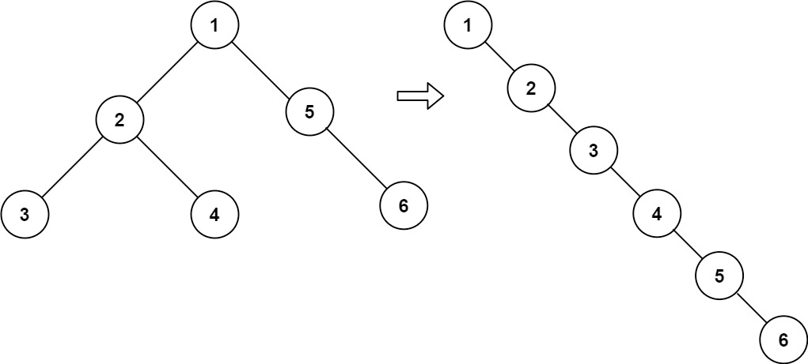

# 114. Flatten Binary Tree to Linked List

- Difficulty: Medium
- Tags: Linked List, Stack, Tree, Depth-First Search, Binary Tree

## Problem

Given the root of a binary tree, flatten the tree into a linked list in place.

The flattened tree should:

- use the same `TreeNode` structure,
- set each node's `right` pointer to the next node in the list,
- set each node's `left` pointer to `null`,
- follow the same order as a preorder traversal of the original tree.

## Examples

### Example 1

Input: `root = [1,2,5,3,4,null,6]`  
Output: `[1,null,2,null,3,null,4,null,5,null,6]`

### Example 2

Input: `root = []`  
Output: `[]`

### Example 3

Input: `root = [0]`  
Output: `[0]`

## Constraints

- The number of nodes in the tree is in the range `[0, 2000]`.
- `-100 <= Node.val <= 100`

## Approach

This solution flattens the tree iteratively in place:

- Start from the root and walk down the tree using the `right` pointer.
- Whenever a node has a left subtree, find the rightmost node in that left subtree.
- Connect the original right subtree to that rightmost node.
- Move the left subtree to the right side and set `left` to `null`.
- Continue until the entire tree becomes a single right-leaning chain.

## Complexity

- Time: `O(n)`
- Space: `O(1)`
