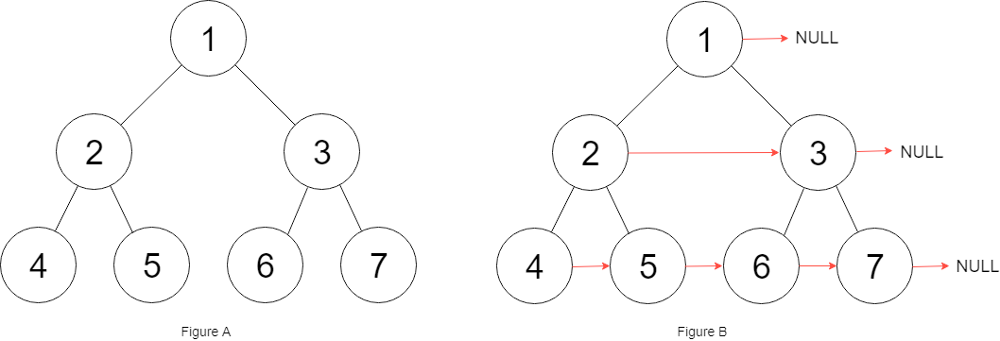

# 116. Populating Next Right Pointers in Each Node

- Difficulty: Medium
- Tags: Linked List, Tree, Depth-First Search, Breadth-First Search, Binary Tree

## Problem

You are given a perfect binary tree where all leaves are on the same level and every parent has exactly two children.

```text
struct Node {
    int val;
    Node *left;
    Node *right;
    Node *next;
}
```

Populate each `next` pointer so that it points to its next right node. If there is no next right node, the `next` pointer should be set to `NULL`.

Initially, all `next` pointers are set to `NULL`.

## Examples

### Example 1



Input: `root = [1,2,3,4,5,6,7]`  
Output: `[1,#,2,3,#,4,5,6,7,#]`  
Explanation: Each level is connected from left to right, and `#` marks the end of a level.

### Example 2

Input: `root = []`  
Output: `[]`

## Constraints

- The number of nodes in the tree is in the range `[0, 2^12 - 1]`.
- `-1000 <= Node.val <= 1000`

## Follow-Up

- Use only constant extra space.
- Recursive stack space is allowed and does not count toward the extra-space limit.

## Approach

This solution uses the perfect-tree structure to connect nodes level by level in `O(1)` extra space:

- Start from the leftmost node of the current level.
- Connect each node's left child to its right child.
- If the current node has a neighbor on the same level, connect its right child to that neighbor's left child.
- Move horizontally using the existing `next` pointers.
- After finishing a level, move down to the next level's leftmost node.

## Complexity

- Time: `O(n)`
- Space: `O(1)`
