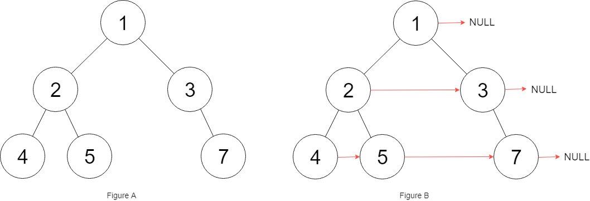

# 117. Populating Next Right Pointers in Each Node II

- Difficulty: Medium
- Tags: Linked List, Tree, Depth-First Search, Breadth-First Search, Binary Tree

## Problem

Given a binary tree:

```text
struct Node {
    int val;
    Node *left;
    Node *right;
    Node *next;
}
```

Populate each `next` pointer so that it points to its next right node. If there is no next right node, the `next` pointer should be set to `NULL`.

Initially, all `next` pointers are set to `NULL`.

## Examples

### Example 1



Input: `root = [1,2,3,4,5,null,7]`  
Output: `[1,#,2,3,#,4,5,7,#]`  
Explanation: Each level is connected from left to right, and `#` marks the end of a level.

### Example 2

Input: `root = []`  
Output: `[]`

## Constraints

- The number of nodes in the tree is in the range `[0, 6000]`.
- `-100 <= Node.val <= 100`

## Approach

This solution connects nodes level by level using already built `next` pointers:

- Traverse the current level from left to right using `next`.
- Use a dummy head and tail pointer to build the linked list for the next level.
- Whenever a node has a left or right child, append that child to the next level chain.
- After finishing one level, move to the first node of the next level using `dummy.next`.
- Reset `dummy.next` before building the following level.

## Complexity

- Time: `O(n)`
- Space: `O(1)`
